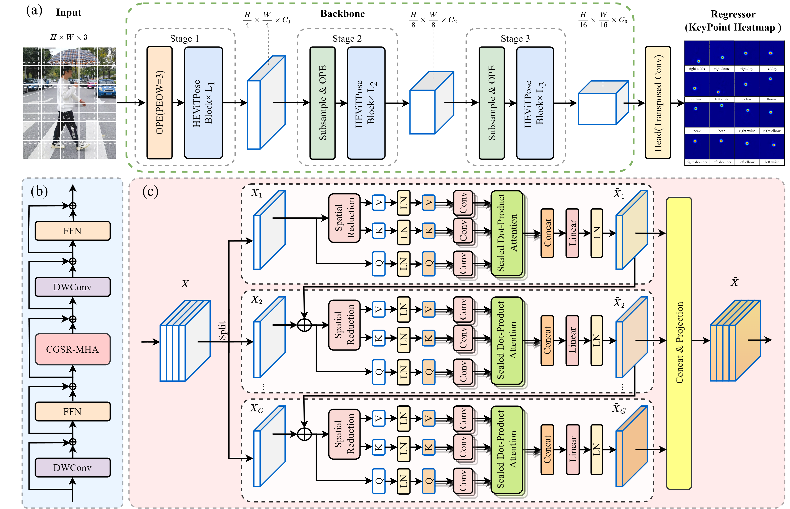

# HEViTPose: High-Efficiency Vision Transformer for Human Pose Estimation

## Code coming soon...

## Paper

> [HEViTPose: High-Efficiency Vision Transformer for Human Pose Estimation](https://arxiv.org/pdf/2311.13615.pdf)  
> Chengpeng Wu, Guangxing Tan*, Chunyu Li

## The network architecture of HEVITPose



## Main Results
With the code contained in this repo, you should be able to reproduce the following results. 
### Results on MPII val and test set
|   Method      |   Test set    | Input size |Params |GFLOPs | Hea| Sho| Elb| Wri |Hip| Kne |Ank |Total|
|---------------|---------------|------------|-------|-------|----|----|----|-----|----|-----|----|-----|
| HEViTPose-T   | MPII val      |  256×256   | 3.21M | 1.75G | 95.9 |94.9 |87.4 |81.6 |87.4 | 81.6 |77.2 |87.2|
| HEViTPose-S   | MPII val      |  256×256   | 5.88M | 3.64G | 96.3 |95.2 |88.7 |83.3 |88.5 |83.9 |79.5 |88.5|
| HEViTPose-B   | MPII val      |  256×256   | 10.63M| 5.58G | 96.5 |95.6 |89.5 |84.5 |89.1 |85.7 |81.1 |89.4|
| HEViTPose-T   | MPII test-dev |  256×256   | 3.21M | 1.75G | 97.6 |95.1 |89.0 |83.6 |89.1 |83.9 |79.1 |88.7|
| HEViTPose-S   | MPII test-dev |  256×256   | 5.88M | 3.64G | 97.8 |95.9 |90.5 |86.0 |89.7 |86.0 |81.7 |90.1|
| HEViTPose-B   | MPII test-dev |  256×256   | 10.63M| 5.58G | 98.0 |96.1 |91.3 |86.5 |90.2 |86.6 |83.0 |90.7|

### Results on COCO val2017 and test-dev2017 set
| Method     | Test set      | Input size |  AP | AP .5|AP .75|AP (M)|AP (L)| AR   |
|------------|---------------|------------|-----|------|------|------|------|------| 
| HEViTPose-B| COCO val      | 256×256    | 75.4| 93.6 | 83.5 | 72.4 | 79.6 | 78.2 | 
| HEViTPose-B| COCO test-dev | 256×256    | 72.6| 92.0 | 80.9 | 69.2 | 78.2 | 78.0 |  


## Visualization
Some examples of the prediction results of the HEViTPose network model for
human posture include occlusion, multiple people, viewpoint and appearance change on the MPII (top) and COCO (bottom) data sets.


## Installation

### 1. Clone code
```shell
    git clone https://github.com/T1sweet/HEViTPose
    cd ./HEViTPose
```

### 2. Create a conda environment for this repo
```shell
    conda create -n HEViTPose python=3.9
    conda activate HEViTPose
```

### 3. Install PyTorch >= 1.6.0 following official instruction, e.g.
Our model is trained in a GPU platforms and relies on the following versions: 
torch==1.10.1+cu113, torchvision==0.11.2+cu113
```shell
    conda install pytorch torchvision cudatoolkit=11.3 -c pytorch
```

### 4. Install other dependency python packages
Our code is based on the MMPose 0.29.0 code database, and dependencies can be installed through the methods provided by [MMPose](https://github.com/open-mmlab/mmpose/blob/v0.29.0/docs/en/install.md). 
Install MMCV using MIM.
```shell
    conda install pytorch torchvision cudatoolkit=11.3 -c pytorch
    pip install -U openmim
    mim install mmcv-full==1.4.5
```
Install other dependency.
```shell
    pip install -r requirements.txt
```

### 5. Prepare dataset
Download [MPII](http://human-pose.mpi-inf.mpg.de/#download) and [COCO ](https://cocodataset.org/#home) from website and put the zip file under the directory following below structure, (xxx.json) denotes their original name.

```
./data
|── coco
│   └── annotations
|   |   └──coco_train.json(person_keypoints_train2017.json)
|   |   └──coco_val.json(person_keypoints_val2017.json)
|   |   └──coco_test.json(image_info_test-dev2017.json)
|   └── images
|   |   └──train2017
|   |   |   └──000000000009.jpg
|   |   └──val2017
|   |   |   └──000000000139.jpg
|   |   └──test2017
|   |   |   └──000000000001.jpg
├── mpii
│   └── annotations
|   |   └──mpii_train.json(refer to DEKR, link:https://github.com/HRNet/DEKR)
|   |   └──mpii_val.json
|   |   └──mpii_test.json
|   |   └──mpii_gt_val.mat
|   └── images
|   |   └──100000.jpg
```
## Usage

### 1. Download trained model
* [MPII](https://1drv.ms/u/s!AhpKYLhXKpH7gv8RepyMU_iU5uhxhg?e=ygs4Me)
* [COCO](https://1drv.ms/u/s!AhpKYLhXKpH7gv8RepyMU_iU5uhxhg?e=ygs4Me)


### 2. Evaluate Model
Change the checkpoint path by modifying `pretrained` in HEViTPose-B_mpii_256x256.py, and run following commands:
python tools/test.py config checkpoint
`config` option means the configuration file, which must be set.
`checkpoint` option means the training weight file and must be set.

```python
# evaluate HEViTPose-B on mpii val set
python tools/test.py ../configs/body/2d_kpt_sview_rgb_img/topdown_heatmap/HEViTPose-B_mpii_256x256.py /work_dir/HEViTPose/HEViTPose-B.pth

# evaluate HEViTPose-S on mpii val set
python tools/test.py ../configs/body/2d_kpt_sview_rgb_img/topdown_heatmap/HEViTPose-S_mpii_256x256.py /work_dir/HEViTPose/HEViTPose-S.pth

# evaluate HEViTPose-T on mpii val set
python tools/test.py ../configs/body/2d_kpt_sview_rgb_img/topdown_heatmap/HEViTPose-T_mpii_256x256.py /work_dir/HEViTPose/HEViTPose-T.pth

# evaluate HEViTPose-B on coco val set
python tools/test.py ../configs/body/2d_kpt_sview_rgb_img/topdown_heatmap/HEViTPose-B_coco_256x256.py /work_dir/HEViTPose/HEViTPose-B_coco.pth

```

### 3. Train Model
Change the checkpoint path by modifying `pretrained` in HEViTPose-B_mpii_256x256.py, and run following commands:
```python
# evaluate HEViTPose-B on mpii val set
python tools/train.py ../configs/body/2d_kpt_sview_rgb_img/topdown_heatmap/HEViTPose-B_mpii_256x256.py

# evaluate HEViTPose-B on coco val2017 set
python tools/train.py ../configs/body/2d_kpt_sview_rgb_img/topdown_heatmap/HEViTPose-B_coco_256x256.py
```

## Contact me
If you have any questions about this code or paper, feel free to contact me at
CP935011539@outlook.com.


## Citations
If you find this code useful for your research, please cite our paper:

```
@misc{wu2024hevitpose,
    title     = {HEViTPose: High-Efficiency Vision Transformer for Human Pose Estimation},
    author    = {Chengpeng Wu, Guangxing Tan*, Chunyu Li},
    booktitle = {Proceedings of the IEEE/CVF Conference on Computer Vision and Pattern Recognition (CVPR)},
    year      = {2023},
    eprint={2311.13615 },
    archivePrefix={arXiv},
    primaryClass={cs.CV}
}
```


## Acknowledgement
This algorithm is based on code database [MMPose](https://github.com/open-mmlab/mmpose/tree/v0.29.0), and its main ideas are inspired by [EfficientViT](https://openaccess.thecvf.com/content/CVPR2023/papers/Liu_EfficientViT_Memory_Efficient_Vision_Transformer_With_Cascaded_Group_Attention_CVPR_2023_paper.pdf), [PVTv2](https://link.springer.com/content/pdf/10.1007/s41095-022-0274-8.pdf), [Swin](https://openaccess.thecvf.com/content/ICCV2021/papers/Liu_Swin_Transformer_Hierarchical_Vision_Transformer_Using_Shifted_Windows_ICCV_2021_paper.pdf) and other papers.

```bibtex
@misc{mmpose2020,
    title={OpenMMLab Pose Estimation Toolbox and Benchmark},
    author={MMPose Contributors},
    howpublished = {\url{https://github.com/open-mmlab/mmpose}},
    year={2020}
}
```
