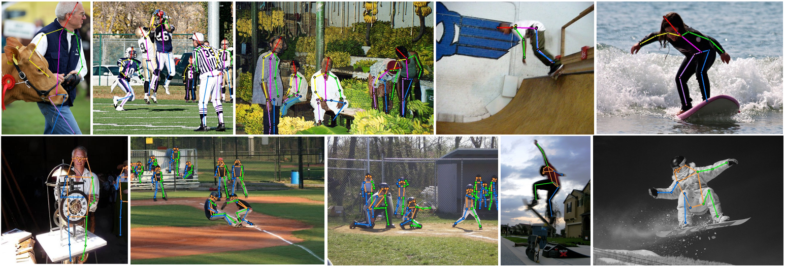

# HEViTPose: High-Efficiency Vision Transformer for Human Pose Estimation

[[`Paper`](.pdf)]

> [HEViTPose: High-Efficiency Vision Transformer for Human Pose Estimation](.html)  
> Chengpeng Wu, Guangxing Tan*, Chunyu Li


## Code coming soon...


## Installation

### 1. Clone code
```shell
    git clone https://github.com/T1sweet/HEViTPose
    cd ./HEViTPose
```

### 2. Create a conda environment for this repo
```shell
    conda create -n HEViTPose python=3.9
    conda activate HEViTPose
```

### 3. Install PyTorch >= 1.6.0 following official instruction, e.g.
Our model is trained in a GPU platforms and relies on the following versions: 
torch==1.10.1+cu113, torchvision==0.11.2+cu113
```shell
    conda install pytorch torchvision cudatoolkit=11.3 -c pytorch
```

### 4. Install other dependency python packages
Our code is based on the MMPose 0.29.0 code database, and dependencies can be installed through the methods provided by [MMPose](https://github.com/open-mmlab/mmpose/blob/v0.29.0/docs/en/install.md). 
Install MMCV using MIM.
```shell
    conda install pytorch torchvision cudatoolkit=11.3 -c pytorch
    pip install -U openmim
    mim install mmcv-full==1.4.5
```
Install other dependency.
```shell
    pip install -r requirements.txt
```

### 5. Prepare dataset
Download [COCO ](https://cocodataset.org/#home) and [MPII](http://human-pose.mpi-inf.mpg.de/#download) from website and put the zip file under the directory following below structure, (xxx.json) denotes their original name.

```
./data
|── coco
│   └── annotations
|   |   └──coco_train.json(person_keypoints_train2017.json)
|   |   └──coco_val.json(person_keypoints_val2017.json)
|   |   └──coco_test.json(image_info_test-dev2017.json)
|   └── images
|   |   └──train2017
|   |   |   └──000000000009.jpg
|   |   └──val2017
|   |   |   └──000000000139.jpg
|   |   └──test2017
|   |   |   └──000000000001.jpg
├── mpii
│   └── annotations
|   |   └──mpii_train.json(refer to DEKR, link:https://github.com/HRNet/DEKR)
|   |   └──mpii_val.json
|   |   └──mpii_test.json
|   |   └──mpii_gt_val.mat
|   └── images
|   |   └──100000.jpg
```
## Usage

### 1. Download trained model
* [COCO](https://1drv.ms/u/s!AhpKYLhXKpH7gv8RepyMU_iU5uhxhg?e=ygs4Me)
* [MPII](https://1drv.ms/u/s!AhpKYLhXKpH7gv8RepyMU_iU5uhxhg?e=ygs4Me)

### 2. Evaluate Model
Change the checkpoint path by modifying `TEST.MODEL_FILE` option in *.yaml* or command line. 

`--gpus` option specifies the gpu ids for evaluation, multiple ids denotes multiple gpu evaluation.

```python
# evaluate on coco val set with 2 gpus
python tools/valid.py --cfg experiments/coco.yaml --gpus 0,1 TEST.MODEL_FILE model/coco/checkpoint.pth.tar

# evaluate on coco test-dev set with 2 gpus (submit to codalab)
python tools/infer_coco_testdev.py --cfg experiments/coco.yaml --gpus 0,1 TEST.MODEL_FILE model/coco/checkpoint.pth.tar

# evaluate on crowdpose test set with 2 gpus
python tools/valid.py --cfg experiments/crowdpose.yaml --gpus 0,1 TEST.MODEL_FILE model/crowdpose/checkpoint.pth.tar

# evaluate on ochuman test set with 2 gpus (trained on ochuman val set)
python tools/valid.py --cfg experiments/ochuman_val.yaml --gpus 0,1 TEST.MODEL_FILE model/ochuman/checkpoint.pth.tar

# evaluate on ochuman test set with 2 gpus (trained on coco train set)
python tools/valid.py --cfg experiments/ochuman_coco.yaml --gpus 0,1 TEST.MODEL_FILE model/coco/checkpoint.pth.tar

# evaluate on ochuman val set with 2 gpus (trained on coco train set)
python tools/valid.py --cfg experiments/ochuman_coco.yaml --gpus 0,1 TEST.MODEL_FILE model/coco/checkpoint.pth.tar DATASET.TEST val
```

### 3. Train Model

You need to download HRNet-W32 imagenet pretrained model (see above) and change the checkpoint path by modifying `MODEL.PRETRAINED` in .yaml, and run following commands:
```python
# train on coco with 2 gpus
python tools/train.py --cfg experiments/coco.yaml --gpus 0,1

# train on crowdpose with 2 gpus
python tools/train.py --cfg experiments/crowdpose.yaml --gpus 0,1

# train on ochuman with 2 gpus
python tools/train.py --cfg experiments/ochuman_val.yaml --gpus 0,1
```

The experimental results are obtained by training on two NVIDIA RTX 3090. You can use more gpu cards for model training by specifying gpu ids in `--gpus` optition, *e.g.*, training model on crowdpose on 8 gpu cards by
```python
# train on coco with 8 gpus
python tools/train.py --cfg experiments/coco.yaml --gpus 0,1,2,3,4,5,6,7
```

Note that you should modify corresponding batch size for each gpu by `TRAIN.IMAGES_PER_GPU`.

## Main Results
With the code contained in this repo, you should be able to reproduce the following results. 
### Results on MPII val and test set
|   Method     |   Test set    | Input size |Params |GFLOPs | Hea| Sho| Elb| Wri |Hip| Kne |Ank |Total|
|---------------|---------------|------------|-------|-------|----|----|----|-----|---|-----|----|-----|
| HEViTPose-T   | MPII val      |  256×256  | 3.21M | 1.75G | 97.6 |95.1 |89.0 |83.6 |89.1 |83.9 |79.1 |88.7|
| HEViTPose-S   | MPII val      |  256×256    | 5.88M | 3.64G | 97.8 |95.9 |90.5 |86.0 |89.7 |86.0 |81.7 |90.1|
| HEViTPose-B   | MPII val      |  256×256   | 10.63M| 5.58G | 98.0 |96.1 |91.3 |86.5 |90.2 |86.6 |83.0 |90.7|
| HEViTPose-T   | MPII test-dev |  256×256    | 3.21M | 1.75G | 97.6 |95.1 |89.0 |83.6 |89.1 |83.9 |79.1 |88.7|
| HEViTPose-S  | MPII test-dev |   256×256   | 5.88M | 3.64G | 97.8 |95.9 |90.5 |86.0 |89.7 |86.0 |81.7 |90.1|
| HEViTPose-B   | MPII test-dev |  256×256   | 10.63M| 5.58G | 98.0 |96.1 |91.3 |86.5 |90.2 |86.6 |83.0 |90.7|

### Results on COCO val2017 and test-dev2017 set
| Method| Test set | Input size |     AP | AP.5 | AP .75 | AP (M) | AP (L) |
|----------|----------|------------|-------|-------|--------|--------|--------| 
| HEViTPose-B| COCO val | 256×256      | 69.8  | 88.5  |  76.6  |  64.0  |  78.9  | 
| HEViTPose-B| COCO test-dev | 256×256   | 69.1  | 89.9  |  76.3  |  63.4  |  77.6  |  

### Visualization of Human Pose Estimation

## Citations
If you find this code useful for your research, please cite our paper:

```
@InProceedings{Wang_2022_CVPR,
    author    = {Chengpeng Wu, Guangxing Tan*, Chunyu Li},
    title     = {HEViTPose: High-Efficiency Vision Transformer for Human Pose Estimation},
    booktitle = {Proceedings of the IEEE/CVF Conference on Computer Vision and Pattern Recognition (CVPR)},
    month     = {June},
    year      = {2024},
    pages     = {11060-11068}
}
```
## Contact me
If you have any questions about this code or paper, feel free to contact me at
CP935011539@outlook.com.

## Acknowledgement
This algorithm is based on code database [MMPose](https://github.com/open-mmlab/mmpose/tree/v0.29.0), and its main ideas are inspired by [EfficientViT](https://openaccess.thecvf.com/content/CVPR2023/papers/Liu_EfficientViT_Memory_Efficient_Vision_Transformer_With_Cascaded_Group_Attention_CVPR_2023_paper.pdf), [PVTv2](https://link.springer.com/content/pdf/10.1007/s41095-022-0274-8.pdf), [Swin](https://openaccess.thecvf.com/content/ICCV2021/papers/Liu_Swin_Transformer_Hierarchical_Vision_Transformer_Using_Shifted_Windows_ICCV_2021_paper.pdf) and other papers.

```
@misc{mmpose2020,
    title={OpenMMLab Pose Estimation Toolbox and Benchmark},
    author={MMPose Contributors},
    howpublished = {\url{https://github.com/open-mmlab/mmpose}},
    year={2020}
}
```
